# AlphaPilot 本地浏览器验收（真实全栈 + 真 Chrome 截图实录）

> 2026-07-06 · 由 Claude 在本机自动执行：隔离环境起 **api + scheduler + webapp** 三进程，
> Playwright 驱动本机 Chrome（headless，1600×950）真实登录并逐页走查，截图落盘于 `img/`。
> 数据为 seed 演示数据 + **真连 Binance** 的实时行情；无真实交易 Key（不真实下单）。
> 配套文档：[本地启动指南](../本地启动指南.md) · [testnet验收手册](../testnet验收手册.md) · [e2e API 层验收报告](../worklog/20260706_1540_本地e2e验收报告.md)（63/63 PASS）

## 环境与启动步骤（复现方式）

1. `docker start alpha-pilot-postgres-1 alpha-pilot-redis-1`；创建隔离库 `alphapilot_e2e` 并 `alembic upgrade head`
2. 隔离环境变量（独立密钥/Redis db7/策略循环 2 分钟/`NO_PROXY=localhost`），**不触碰真实 .env**
3. 三进程：`uvicorn src.app:app --port 8000` ＋ `python scripts/start_scheduler.py` ＋ `cd webapp && npm run dev:real`（:5174）
4. seed 演示数据（48 点权益曲线、5 条决策含三种守卫裁决、1 持仓、6 笔交易、影子候选、K线）
5. Playwright（channel=chrome）执行 15 步走查，每步截图 + 收集控制台错误

---

## 走查实录（15 步）

### 1. 登录页 — `01_login.png`
品牌面板 + 表单；未登录访问任意受保护页面均被重定向到此（RequireAuth 生效）。
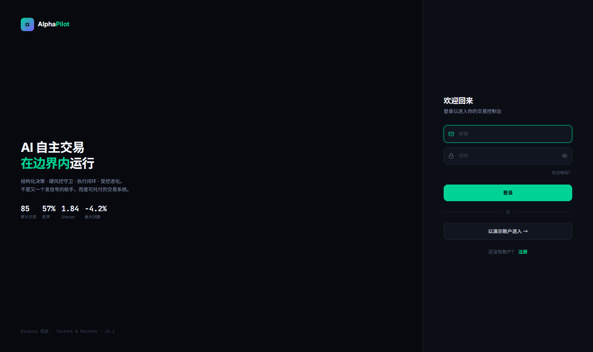

### 2. 登录成功 → 主控台 — `02_dashboard.png`
`POST /api/auth/login` 返回 200 success，**httpOnly cookie（ap_token）会话**建立。
看点：AI 决策卡**阶段点亮**（采集快照→AI 推理→守卫检查→风险裁决→执行下单）、
权益曲线（seed 48 点）、右侧**事件流 LIVE 实时滚动**（`position.updated` 每 10 秒——
scheduler 持仓监控 → EventShuttle → Redis Pub/Sub → `/ws` 广播，本次修复的实时链路在真页面生效）、
顶栏风控胶囊「风控正常」。
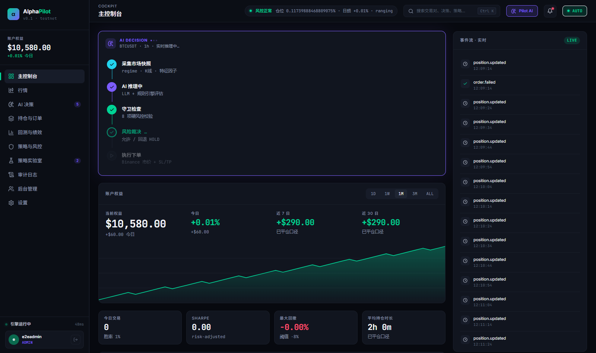

### 3. 主控台全页 — `03_dashboard_full.png`
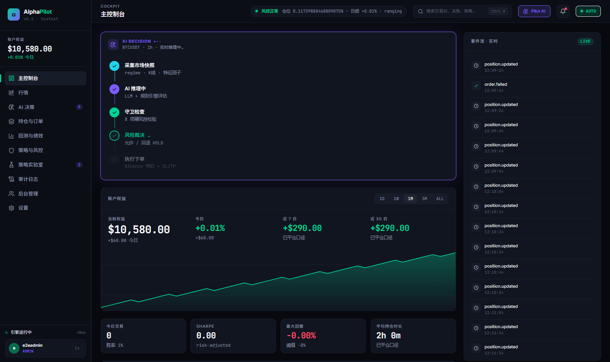

### 4. 行情页 — `04_market.png`
**全部真数据**：自选列表 BTC/ETH/SOL 实时价格（真连 Binance testnet）、K线真实渲染（含 TP/入场标线）、
AI 解读条显示 regime=ranging + **资金费率 0.0100% / 持仓量 / 下次结算倒计时**（USDT-M 公共指标真值）、
右侧手动下单面板的**守卫预检逐项**实时返回（kill_switch/daily_loss/duplicate_position 已开仓标红 等 10 项）。
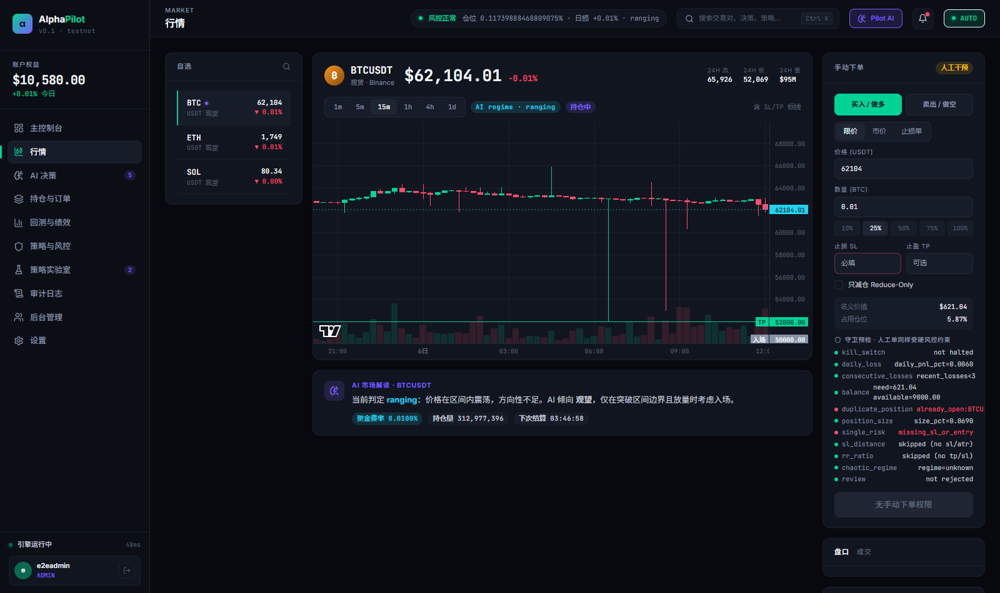

### 5. AI 决策流 — `05_decisions.png`
5 条决策含 **PASS / REJECT / DEGRADE** 三种守卫裁决徽章与推理全文（`guard_verdict` 字段直出）。
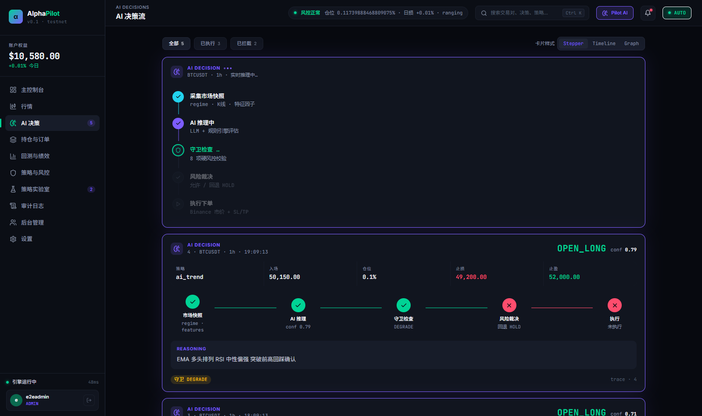

### 6. 持仓与订单 — `06_positions.png`
开仓持仓（策略模式/仓位占比来自决策反查与快照计算）+ 订单簿表。
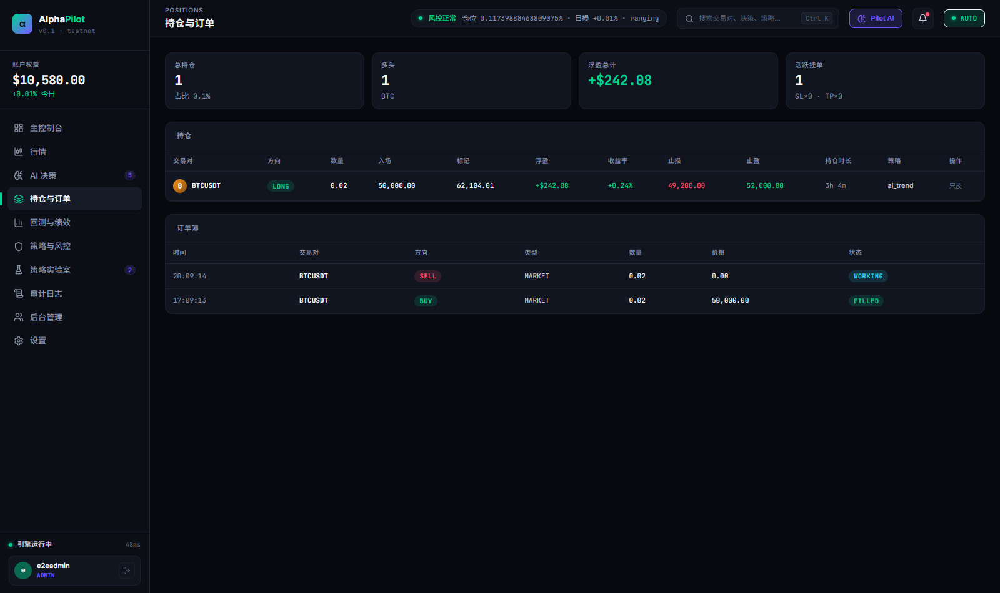

### 7. 回测与绩效 — `07_performance.png`
指标磁贴（胜率/盈亏比等与 seed 交易对账一致）/ vs HODL 曲线 / 月度 PnL / 归因切换。
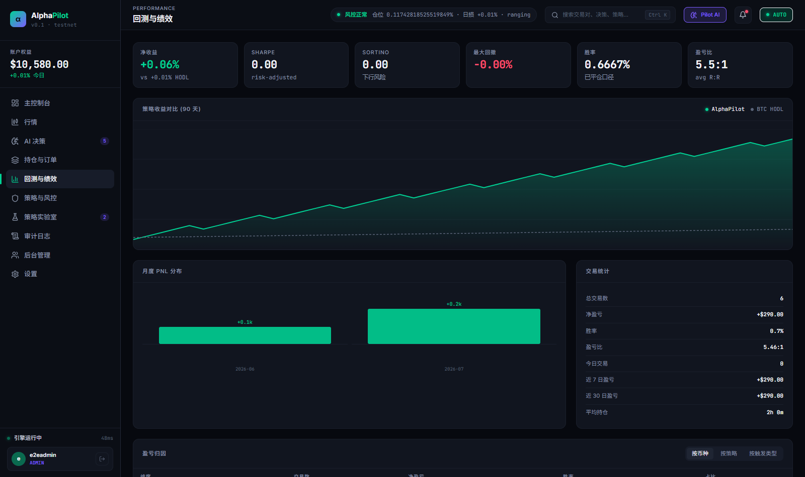

### 8. 策略与风控 — `08_risk.png`
硬风控阈值来自 `GET /api/risk/limits` 真值 + 交易对管理。
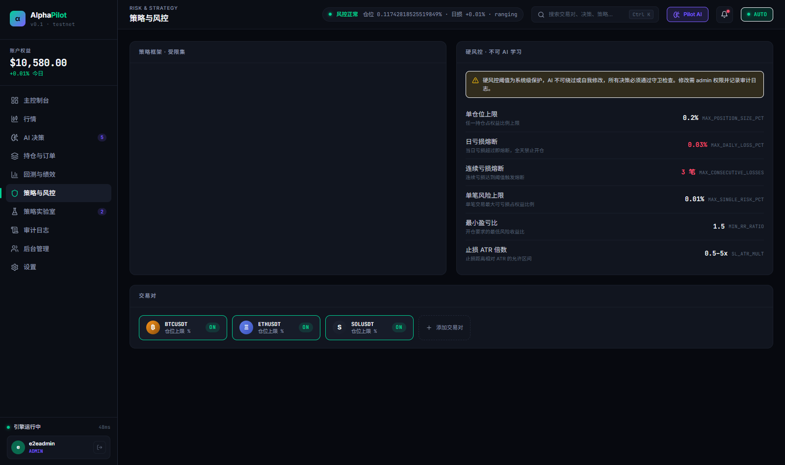

### 9. 策略实验室 — `09_lab.png`
受控进化流水线图示 + SHADOW 候选（影子进度 3/14 天、对比数据、promote 门槛状态）。
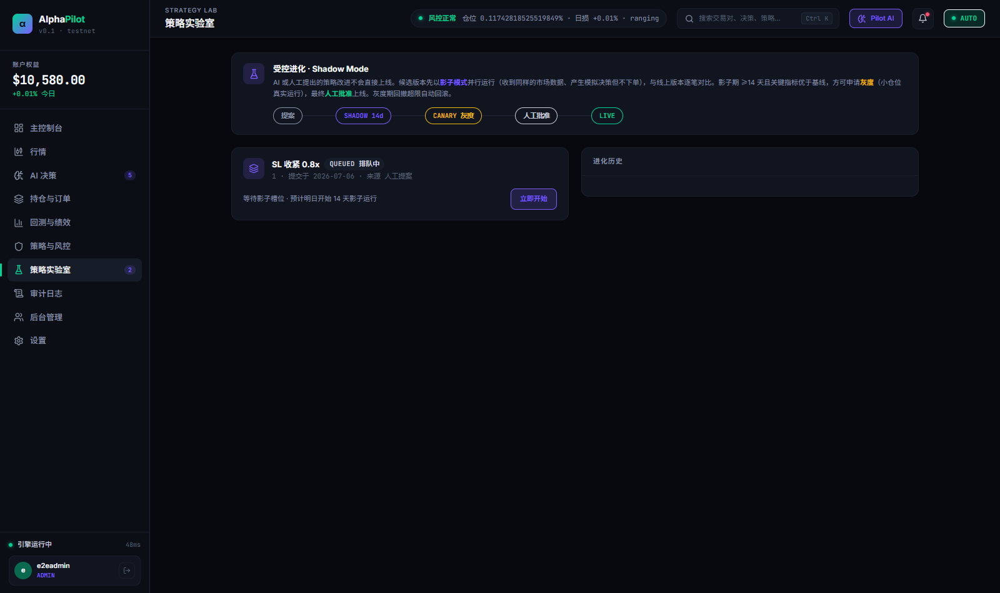

### 10. 审计日志 — `10_audit.png`
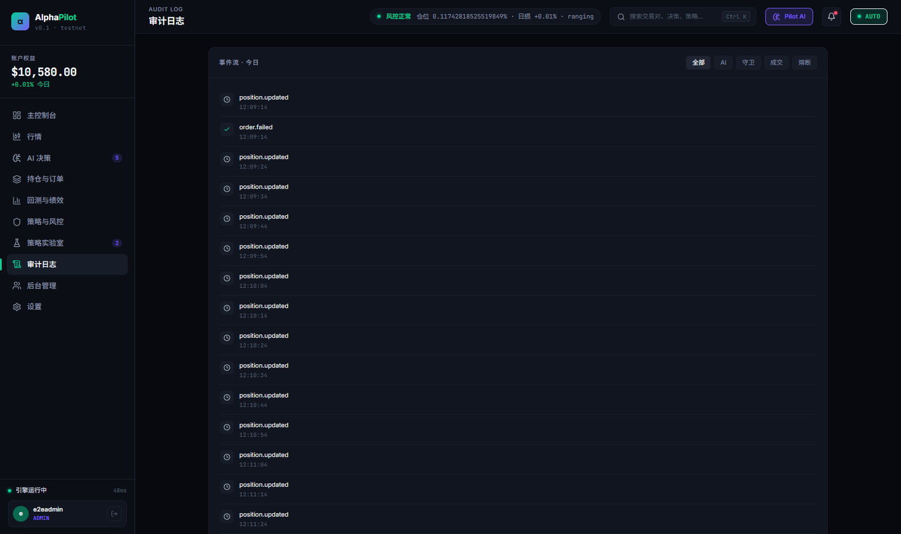

### 11. 设置 — `11_settings.png`
交易所连接 / AI 模型 / 通知 / 账户 四分区（密钥配置后只显示尾 4 位）。
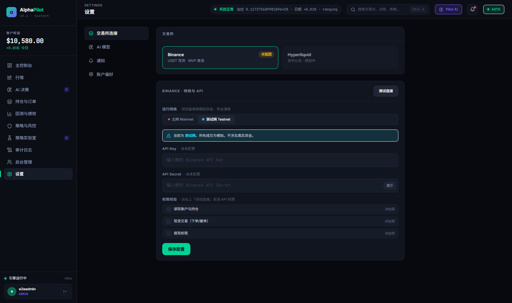

### 12. 后台管理 — `12_admin.png`
用户管理 / 四角色权限矩阵 / 管理日志。

### 13. Pilot AI 对话抽屉 — `13_pilot.png`
顶栏 Pilot AI 打开对话抽屉（SSE 流式；未配 LLM Key 时 Mock 提示，不误下单）。
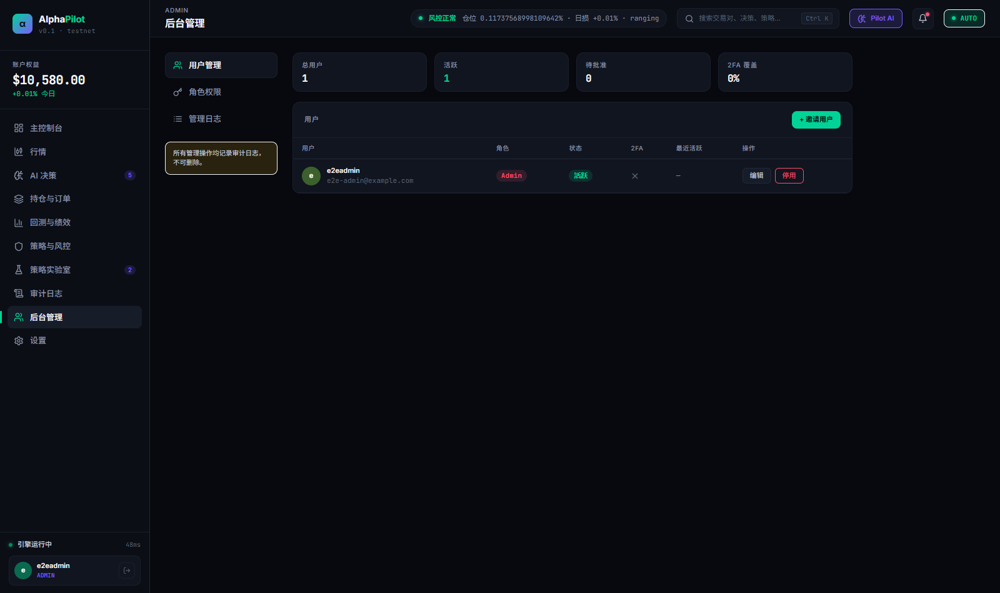

### 14. HALTED 全局联动 — `14_halted.png` ⭐
调用 `POST /api/commands/pause` 后回主控台：**五件套全部联动**——
顶栏胶囊变红「已熔断」、红色横幅（带"查看风控日志/手动恢复"）、决策卡显示守卫 REJECT/回退 HOLD/未执行、
**权益曲线变 rose**、事件流置顶熔断红条。
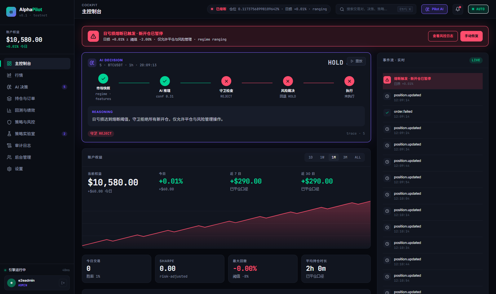

### 15. 恢复运行 — `15_resumed.png`
`resume` 后风控胶囊与页面恢复正常态。
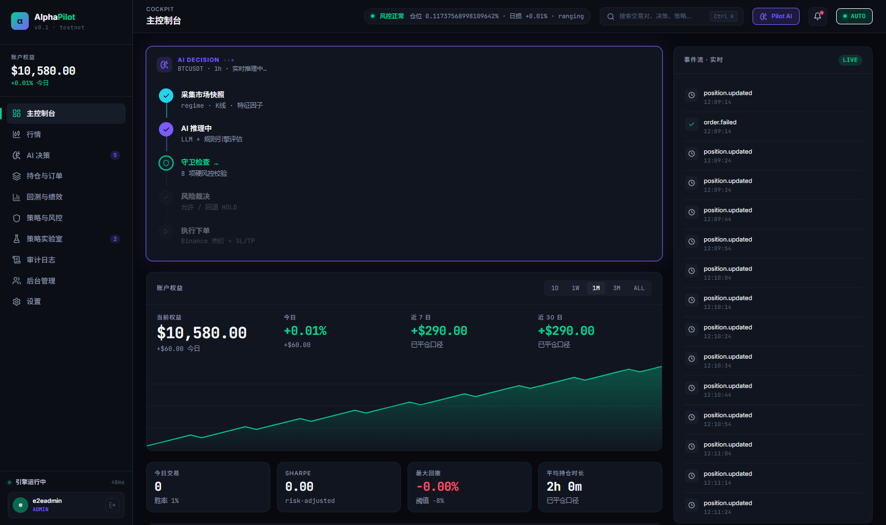

---

## 控制台错误清单（15 页共 7 条，无白屏/无崩溃）

| 页面 | 错误 | 定性 |
|------|------|------|
| 行情页 ×4 | `ws://…/ws/market?symbol=BTCUSDT` 握手 403 | **前端待办**：连接 `/ws/market` 未带 `token` 查询参数（后端鉴权按设计拒绝）。盘口/逐笔因此暂未渲染，其余行情数据正常 |
| 登录页 ×1 | 静态资源 404 | 轻微（favicon 类），不影响功能 |
| 风控页 ×2 | 资源 404 | 前端仍在调用的 mock-only 旧路径，待随接真清理 |

## 发现问题（转前端会话）

1. **行情 WS 未带 token**：`webapp` 连 `/ws/market` 需追加 `?token=<jwt>`（与 `/ws` 主事件流一致）
2. 行情页下单按钮文案「无手动下单权限」：当前登录为 admin（应有权限），疑似前端 `usePermission` 判断或按钮禁用文案与预检结果混用，需核对
3. 登录页/风控页共 3 处 404 资源清理

## 结论

- 11 个页面 + 2 个关键联动（HALTED/恢复）全部真实渲染，无白屏、无 JS 崩溃
- 后端 API/WS/事件/调度链路在真实浏览器场景全部工作（含本轮修复的实时推送与行情 WS 域名）
- 遗留 3 项均为前端侧小改（上表），后端无新增缺陷
- 带真实 Key 的实盘决策链验收 → 照 [testnet验收手册](../testnet验收手册.md) 执行
